

<!-- ═══════════════ 3D ANIMATED BANNER (custom SVG in /assets) ═══════════════ -->

<!-- ═══════════════ TYPING ANIMATION ═══════════════ -->

 

<!-- ═══════════════ BADGES ═══════════════ -->

<!-- Add more badges here, e.g. LinkedIn / Email:

-->

  

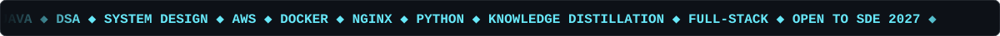

 

<h2 align="center"></h2>

  

<h2 align="center"></h2>


<h2 align="center"></h2>


 

  

| 🔹 Layer | 🔸 Stack |
|:--|:--|
| **Languages** | Java (primary) · Python · SQL · HTML/CSS · Verilog · VHDL |
| **Backend & Cloud** | AWS (S3, EC2) · LocalStack · Docker · NGINX · Reverse Proxies |
| **AI / ML** | Machine Learning · Deep Learning Benchmarking · Zero-Shot Knowledge Distillation · LLM Agents |
| **DSA** | NeetCode roadmap · DP ✅ · Graphs & Greedy 🔜 · OA-focused prep |
| **Tools** | Git · GitHub · ModelSim · MATLAB |

<h2 align="center"></h2>

<h2 align="center"></h2>

<a href="https://github.com/PRIYESHSINGH24?tab=repositories">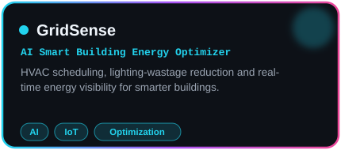</a><a href="https://github.com/PRIYESHSINGH24?tab=repositories">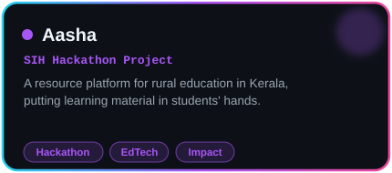</a> 
<a href="https://github.com/PRIYESHSINGH24?tab=repositories">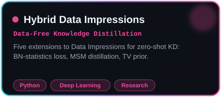</a><a href="https://github.com/PRIYESHSINGH24?tab=repositories">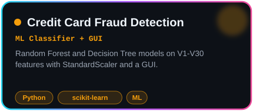</a> 
<a href="https://github.com/PRIYESHSINGH24?tab=repositories">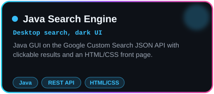</a><a href="https://github.com/PRIYESHSINGH24?tab=repositories">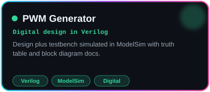</a> 

  

<!-- Want live pinned-repo cards instead? Swap in (replace YOUR_REPO):

-->

<h2 align="center"></h2>

 

 

 

<h2 align="center"></h2>

  

<h2 align="center"></h2>

  <picture>
    <source media="(prefers-color-scheme: dark)" srcset="https://raw.githubusercontent.com/PRIYESHSINGH24/PRIYESHSINGH24/output/github-snake-dark.svg"/>
    <source media="(prefers-color-scheme: light)" srcset="https://raw.githubusercontent.com/PRIYESHSINGH24/PRIYESHSINGH24/output/github-snake.svg"/>
    
  </picture>

<h2 align="center"></h2>

- 🔭 Going deep on **Java**, **System Design** and **DSA** for SDE placements
- 🧠 Pushing my **knowledge-distillation** research further
- ☁️ Building with **AWS · Docker · NGINX** instead of only watching tutorials
- 💼 **Open to SDE roles** (2027 batch) — if you're hiring, let's talk
- ⚡ Ask me about: Java, zero-shot KD, full-stack builds, hackathons

### 🤝 Let's Build Something

 

⭐ Star a repo if it helped — it makes my night-coding sessions worth it 🌙

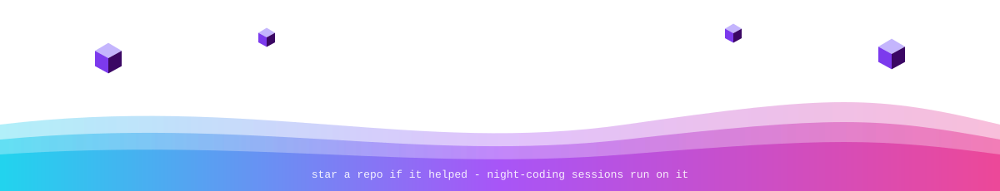

